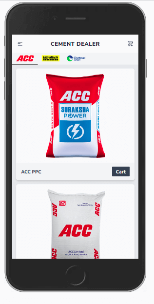
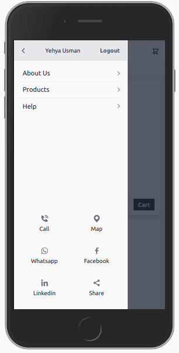
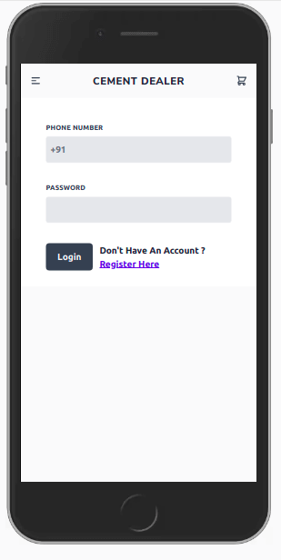
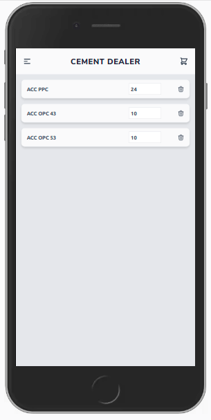
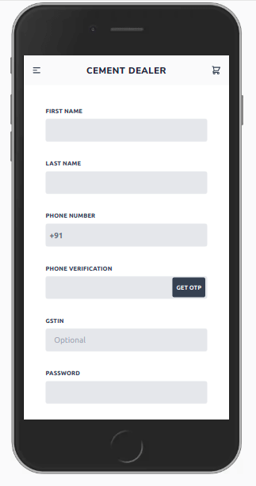

## Cement Dealer App Scaffold (Python 3.8)
*Minimal Prototype*
 
🧰 Tools
- Django
- Django REST Framework
- Vuejs
- Twilio
- Tailwindcss

🏷️ Features
- Products View
- Signup
- Login
- Cart
- Social Links (Phone, Whatsapp etc)
- REST endpoint for product details
- Django Admin view to add products, brands etc
- Automatic media compression
- OTP user phone verification (Twilio)

📷 Images   

